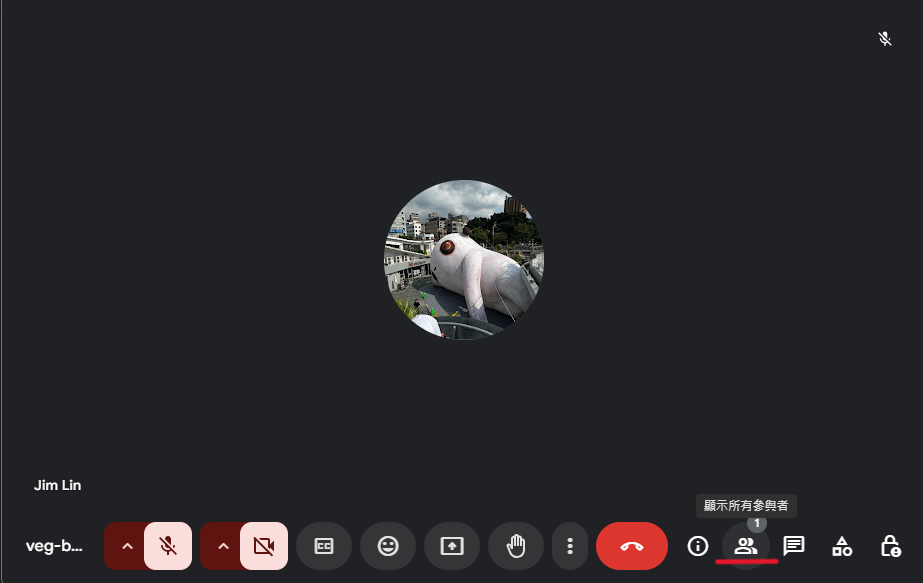

# Google-meet Parasite 互動式透明白板

## 使用步驟

1. 安裝依賴套件

```bash
npm install
```

2. 更新 descriptor
   使用 chrome 打開 Google meet，將 Google meet 的會議 ID 分別覆寫至以下檔案（./descriptor/ChromeGoogleMeet/）:

```bash
Google-meet-roomID.json
```

3. Google meet 點選"顯示所有參與者"
   
   

4. 啟動 Parasite
    * 期間請讓Google meet保持在畫面最頂部
```bash
npm start
```

5. 點選 Google meet 頁面，讓他 focus，Google meet 的部分會有綠色框線，並且左側會出現三個按鈕(連線、白板、彈幕)。
   

6. 按下連線按鈕，會跟 server 建立 web socket 通道進行溝通。
   出現已連線代表連線成功，可以開始使用白板及彈幕功能。
   

7. 安裝影片
    [](https://youtu.be/ps_U1vNYl3A)

## UI介紹
* 整體畫面
    

* 功能按鈕
    

    * 連線按鈕
        * 
        * 點擊後可與伺服器建立連線，並藉由伺服器與他人連線

    * 白板按鈕
        * 
        * 點擊後開啟白板，在白板範圍內（綠色的粗框框）可以利用白板工具欄內的工具進行編輯
        

        * 白板生效範圍：
            * 若當前**無人**分享畫面
            白板不會出現
            

    
            * 若當前**你**在分享畫面
                * 可選擇分享視窗或者分享整個螢幕
                * 並在**白板工具欄**中**選擇對應的分享模式**：
                    * 分享螢幕：
                        * 白板生效範圍為全螢幕
                    * 分享視窗：
                        * 白板生效範圍為全螢幕減去Windows工作列的範圍
                        * **注意：若要分享視窗，請將該視窗最大化，以進行白板間的互動**
            
            

    
            * 若當前**其他人**在分享畫面
            白板生效範圍為被分享的畫面顯示的範圍
            

    * 彈幕按鈕
        * 
            * 點擊後展開彈幕的功能按鈕：
            
            * 發送彈幕（需先點擊連線按鈕連線才可使用）

                * 彈幕發送點擊按鈕： 
                * 點擊後展開信息輸入框： 
                * 可在輸入框中輸入內容，點擊發送按鈕送出：
                * 可以選擇勾選匿名選項： 
                * 發送的信息前面不會屬名： 
    
            * 選擇接收彈幕的人員
                * 點擊： 
                * 會顯示當前連線到伺服器（點擊了連線按鈕）的人員: 
                * 在發送彈幕時，會向被彈幕勾選的人員發送彈幕
                * 若是**沒有勾選任何人員**，則向**所有人**發送彈幕（指有連線的所有人）
    
    * 傳輸按鈕
        * 
        * 需先連線才能上傳/下載檔案
            * 點擊後展開傳輸的功能列表：
                * 被上傳的檔案：
                    * 刪除檔案（只會刪除本地檔案）：
                    * 下載檔案：
                * 上傳檔案：
                * 關閉列表：
                

* 白板工具欄：
    * 樣式為：
    * 可以被滑鼠拖動，放在覺得適當的位置
    * 點擊後展開：

    * 工具欄中的工具（只能用於白板範圍）：
        * 畫筆：
            * 可跟隨滑鼠軌跡留下軌跡

        * 文字輸入：
            * 可以在白板中指定位置輸入文字

        * 圖案：
            * 點擊後展開：
            * 可選
                * 橢圓
                * 矩形
                * 直線
        * 橡皮擦：
            * 滑鼠左鍵按下並移動可以擦除鼠標位置上的白板內容

        * 顏色：
            * 可以選擇畫筆、文字輸入、圖案功能的顏色
            * 點擊後展開：
            * 可選更多顏色：
                * 點擊後開啟更多顏色的選擇介面：
                * 若選擇到當前顏色選擇欄位中不存在的顏色，會將第二列中的顏色往右移（刪除該列最右側的顏色），後將選擇的顏色插入第二列最左邊
                * 例如選取顏色：
                * 列表會更新為：
            

        * 粗細：
            * 點擊後展開：
            * 可以選擇畫筆、文字輸入、圖案、橡皮擦功能的粗細

        * 虛線：
            * 點擊後展開：
            * 可以讓畫筆、圖案、橡皮擦功能變為虛線的形式
        
        * 清除：
            * 清除白板上的所有內容
        
        * 可見/隱藏他人對於你的白板的編輯：
            * 點擊後切換：
            * 若當前為：
                * 可以看見他人對於你的白板的編輯紀錄
            * 若當前為：
                * 他人對於妳的白板的編輯會被隱藏

        * 當前編輯白板：
            * 若當前為聽眾或者無白板狀態，可點擊切換：
                * 我的白板：
                    * 編輯自己的白板
                * 講者白板：
                    * 編輯講者白板，該模式下對白版的編輯會同步到講者的白板
                    * 需要**連線**，才能進行白板編輯的同步

            * 若當前為講者狀態，可點擊切換：
                * **請依分享方式手動切換對應模式**
                * **請先行連線才能進行白板編輯的同步**
                * 分享螢幕：
                    * 進行分享時選擇分享整個螢幕請選擇此模式

                * 分享視窗：
                    * 進行分享時選擇分享個別視窗請選擇此模式
                    * 請將分享的視窗**最大化**
    

        * 截圖：
            * 截圖當前分享的螢幕畫面
            * 紀錄當前白板內容

        * 查看截圖：
            * 開啟儲存（翻頁）面板
    
    * 儲存（翻頁）面板：
        * 觀看被擷取過的圖片（會同步顯示擷取圖片時的白板內容），方向鍵切換頁面
        * 編輯被擷取過的圖片，功能同白板工具欄內的工具（使用白板工具欄選擇工具）
        * 裁切：
            * 裁剪前頁面內容
            * 點擊後面板出現變化：
                * 紅色框框：代表裁切範圍，可以拖動調整範圍
                * 綠色勾勾：
                    * 調整好範圍後點擊可以完成裁剪
                * 紅色叉叉：
                    * 點擊後退出裁剪
                * 裁切此頁/裁切全部： 
                    * 點擊進行切換
                    * 裁切此頁：只裁切當前頁面
                    * 裁切全部：對所有**大小相同**的頁面進行等同於當紅色框框範圍的裁切
            * 為避免調整裁剪範圍時誤觸，點擊裁切按鈕後會自動將當前使用的白板工具切至滑鼠，且若是切換為滑鼠以外的工具，會自行退出裁剪

        * 左移：
            * 將當前頁面的內容向左（前）移動
        
        * 右移：
            * 將當前頁面的內容向右（後）移動
        
        * 複製：
            * 複製當前頁面
        
        * 刪除：
            * 刪除當前頁面

        * 載入： 
            * 載入儲存的.json檔案

        * 匯出：
            * 匯出當前儲存（翻頁）面板內的所有內容
            * 點擊後出現可選項：
            * PDF：儲存成PDF檔案，此後無法讀取
            * JSON：儲存成JSON檔案，可以重複讀取
        * 關閉：
            * 關閉面板

## Feature

- 透明白板
    * 透明的畫布，可以在白板範圍內的任何想要的地方做筆記
    * 功能展示：
        * 畫筆
            * [](https://youtu.be/9bihaETWguo)
        
        * 輸入文字
            * [](https://youtu.be/ZPmFDrFTtIs)

        
        * 圖案
            * 橢圓
                * [](https://youtu.be/9YRnrlS2caI)

            * 矩型
                * [](https://youtu.be/kKC-5Xtp6kk)

            * 直線
                * [](https://youtu.be/tRglK5DBk_8)
        
        * 橡皮擦
            * [](https://youtu.be/BbUR_xQjYUU)
        
        * 顏色選擇
            * [](https://youtu.be/g742fd0Njdo)
        
        * 粗細選擇
            * [](https://youtu.be/M98Y8fPCFgc)
        
        * 虛線
            * [](https://youtu.be/AiOGvYlBGYk)
        
        * 連線功能
            * 聽眾
                * 編輯自己的白板
                * 編輯講者的白板
        
            * 講者
                * 接受其他人的編輯
                * 屏蔽其他人的編輯
            * [](https://youtu.be/dOVXdqidGts)

    * 模式
        * 無白板模式
            * 當前無人分享畫面，白板功能無法使用
    
        * 聽眾模式
            * 當前正在觀看他人分享的畫面，可以在他人分享的畫面上使用白板
    
        * 講者模式
            * 當前正在分享螢幕畫面給他人，整個螢幕都是白板（可讓他人編輯白板的功能限於分享全螢幕）
            [](https://youtu.be/bFUolAyBYfk)
        * 注意事項
            * 當模式切換時在Parasite的UI完成對應的變動前請勿將Google Meet最小化

- 彈幕

  1. 點選彈幕按鈕後，右側會出現三個按鈕(表情符號(尚未完成)、發送彈幕訊息、選擇發送人員)
     
     

  2. 點選第二個按鈕，會出現輸入框，再輸入完成後，可以選擇是否匿名發言，按下發送後，就會將訊息傳送給其他使用者，在對方的螢幕上就會有彈幕訊息飄過。
     
     

  3. 點選地三個按鈕，會出現這個會議室的人員(有裝 Parasite 並且連線到 server 的使用者都會出現在這裡)，可以勾選想要發送彈幕訊息的人，這樣彈幕就只會發送給指定使用者。
     
     

  - 彈幕 demo 影片
    [](https://youtu.be/1A1PEL5SByI)
